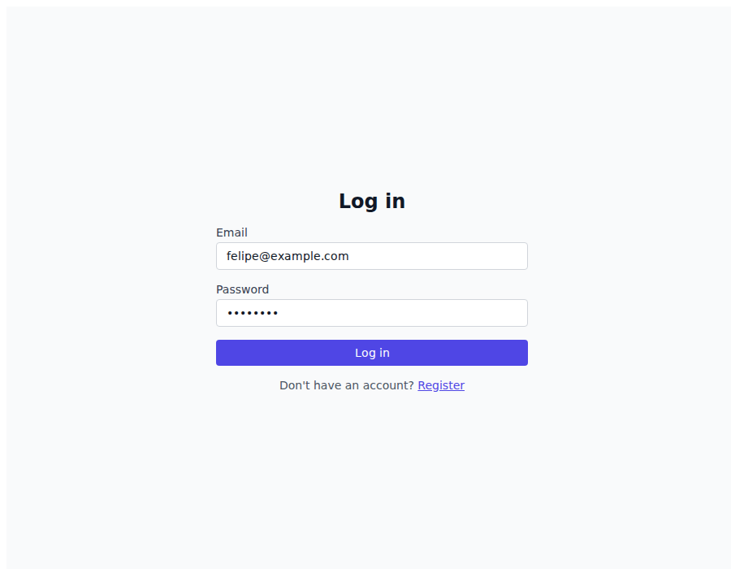
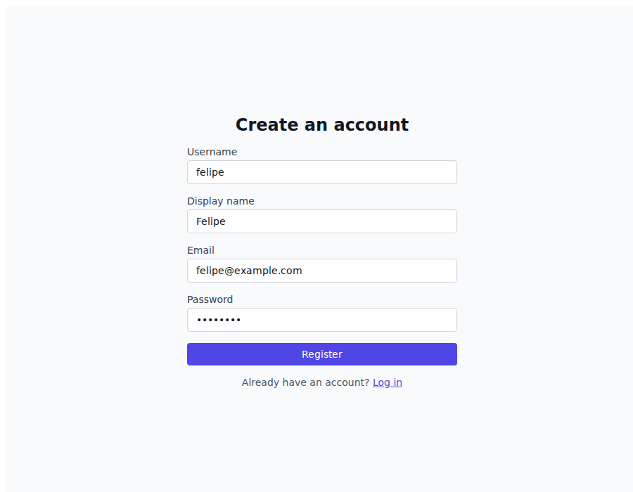
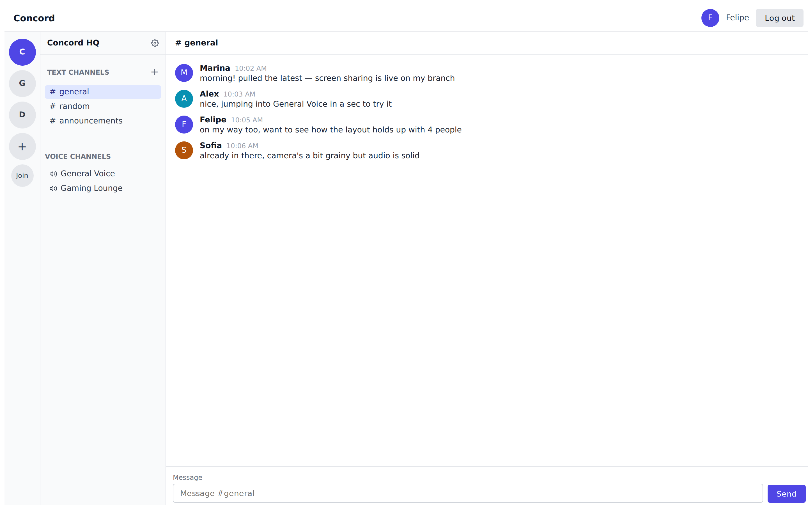
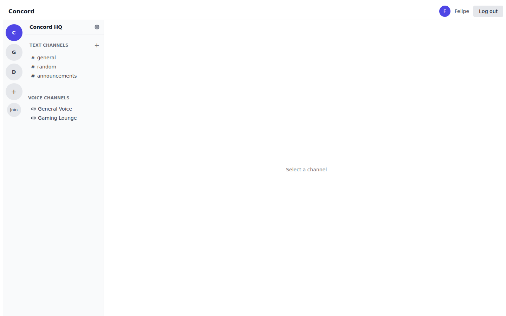
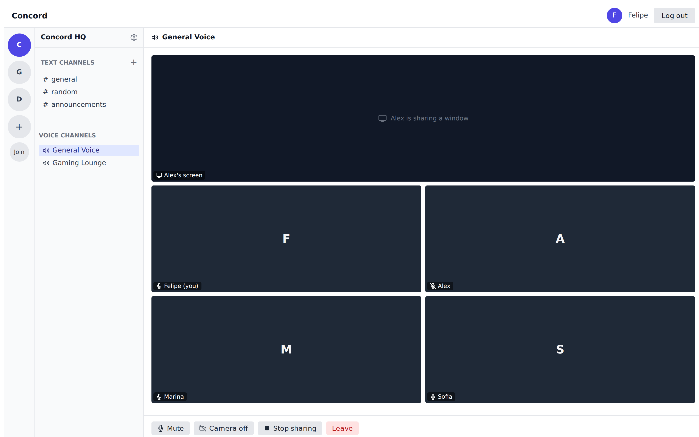
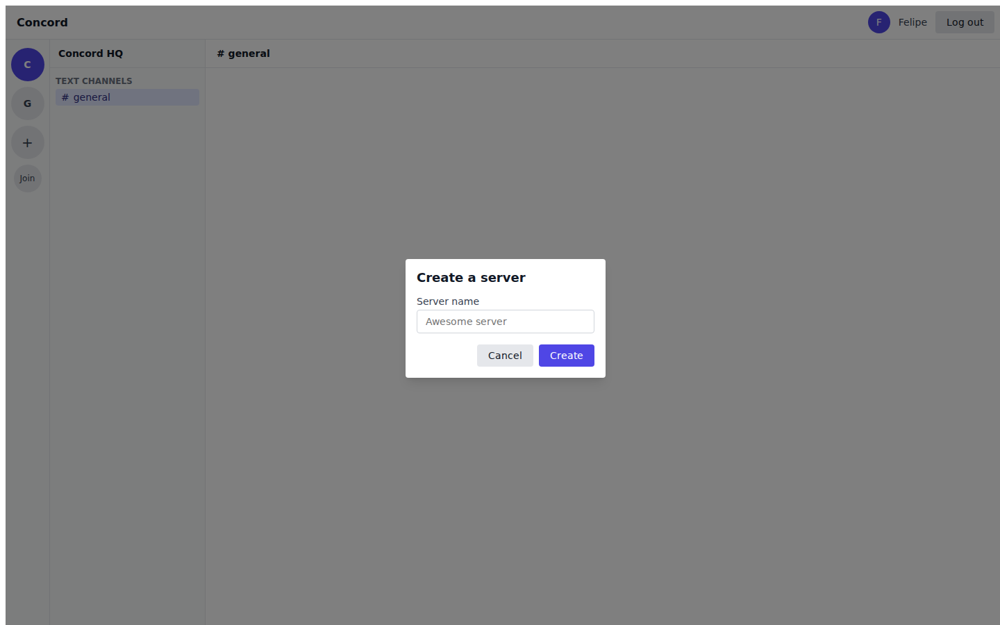
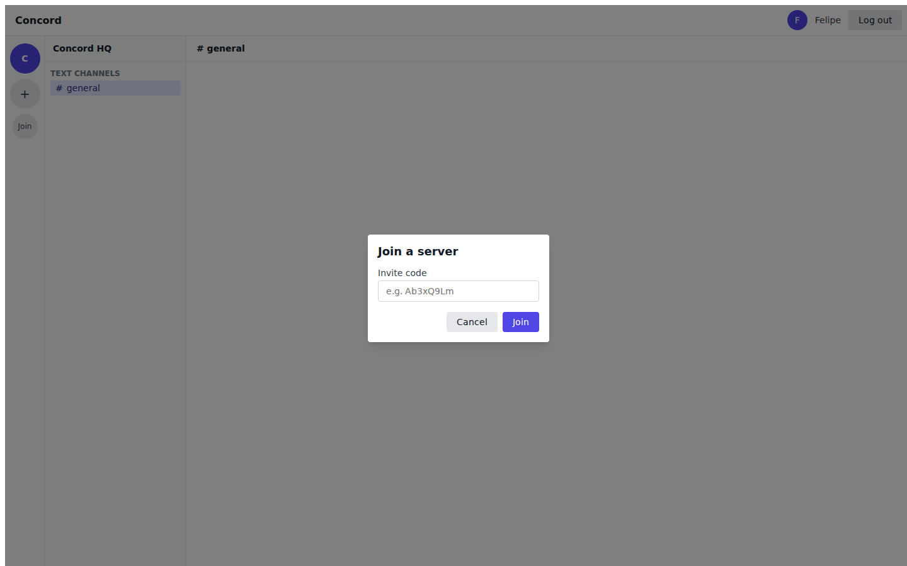
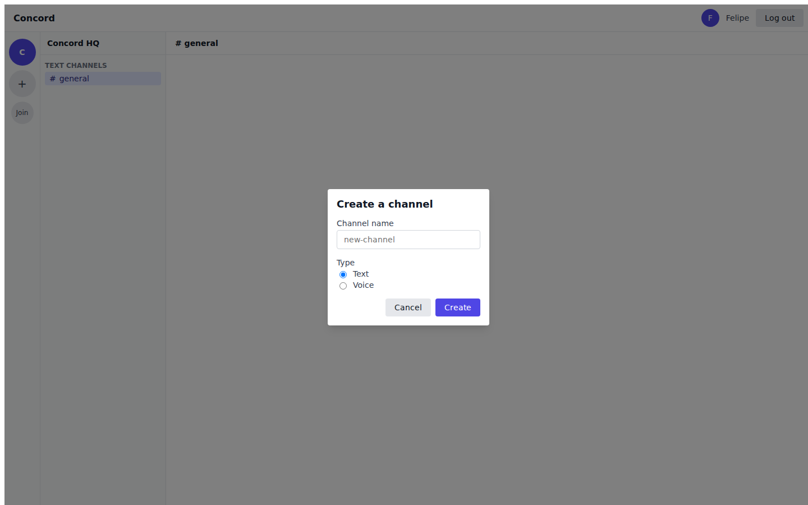
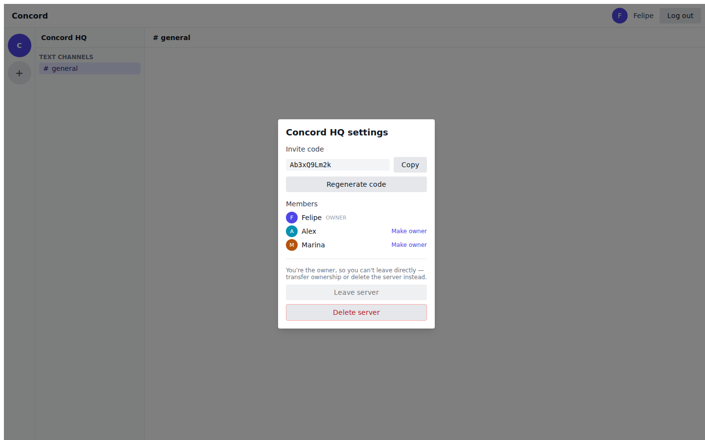

# Discord MVP

A minimal real-time communication platform inspired by Discord.

The project focuses on the core experience of real-time text, voice, video and screen sharing while intentionally keeping the product scope small.

---

## MVP

The MVP provides four main capabilities:

### 💬 Real-Time Text Chat

* Servers
* Text channels
* Real-time messaging
* Message persistence

### 🎤 Voice

* Voice channels
* Join/leave voice channels
* Microphone mute/unmute

### 📹 Video

* Camera on/off
* Multiple participants
* Real-time video

### 🖥️ Screen Sharing

* Start screen sharing
* Stop screen sharing
* View shared screens

Authentication and server/channel management are also included.

---

## Screenshots

Mockups of every screen in the app, drafted with Claude Design to match the app's current UI.

### Log in



### Register



### Text channel



### No channel selected



### Voice channel — camera grid and screen sharing



### Create a server



### Join a server



### Create a channel



### Server settings — invite code and members



---

## Architecture

The project is organized as a monorepo.

```text
discord-mvp/
│
├── frontend/              # React web application
├── backend/               # Spring Boot API
├── infrastructure/        # Docker and infrastructure configuration
├── docs/                  # Architecture and project documentation
├── AGENTS.md              # AI development instructions
└── README.md
```

High-level architecture:

```text
                         Internet
                             |
                         HTTPS / WSS
                             |
                           Nginx
                             |
                  +----------+----------+
                  |                     |
              Frontend               Backend
               React               Spring Boot
                                       |
                    +------------------+----------------+
                    |                  |                |
                PostgreSQL           Redis          LiveKit
                                                         |
                                                       WebRTC
                                                         |
                                      +------------------+----------------+
                                      |                  |                |
                                    Audio              Video           Screen
```

---

## Technology Stack

### Frontend

* React
* TypeScript
* Vite
* Tailwind CSS
* React Router
* TanStack Query
* Zustand

### Backend

* Java 21
* Spring Boot
* Spring Security
* Spring Web
* Spring WebSocket
* Spring Data JPA
* Hibernate
* Flyway

### Data

* PostgreSQL
* Redis

### Real-Time Communication

* WebSocket for application events
* WebRTC for media
* LiveKit as the SFU, including its embedded TURN server (see docs/DECISIONS.md D16 — no
  standalone Coturn service)

### Infrastructure

* Docker
* Docker Compose
* Nginx
* Linux VM

---

## Communication Model

The application uses different technologies for different types of communication.

### Text and Application Events

```text
React
  |
  | WebSocket
  |
Spring Boot
  |
  +---- PostgreSQL
```

WebSocket is responsible for application-level real-time events.

Examples:

```text
MESSAGE_CREATE
MESSAGE_UPDATE
MESSAGE_DELETE
CHANNEL_CREATE
CHANNEL_UPDATE
```

### Voice, Video and Screen Sharing

```text
Client
  |
  | WebRTC
  |
LiveKit SFU
  |
  +---- Participant
  +---- Participant
  +---- Participant
```

Audio, video and screen sharing are not transmitted through the application WebSocket.

---

## Project Principles

### Keep the MVP Small

The project intentionally avoids non-essential Discord features.

### Prefer Simplicity

The simplest solution that satisfies the requirement should be preferred.

### Modular Monolith

The backend is a modular monolith.

Microservices are not required for the MVP.

### Use Existing Infrastructure

WebRTC media infrastructure is provided by LiveKit instead of being implemented from scratch.

### Documentation Is Part of the Project

Architectural decisions and important contracts must be documented under `/docs`.

---

## Development

### Prerequisites

Recommended development environment:

* Git
* Docker
* Docker Compose
* Java 21
* Node.js
* npm

---

## Local Development

Clone the repository:

```bash
git clone <repository-url>
cd discord-mvp
```

Start infrastructure:

```bash
docker compose up -d
```

Start the backend:

```bash
cd backend
./mvnw spring-boot:run
```

Start the frontend:

```bash
cd frontend
npm install
npm run dev
```

The exact commands may evolve as the project is implemented.

---

## Documentation

Project documentation is maintained under `/docs`.

Expected documentation:

```text
docs/
├── PRODUCT.md
├── ARCHITECTURE.md
├── TECH_STACK.md
├── DATABASE.md
├── API.md
├── WEBSOCKET.md
├── WEBRTC.md
├── DEVELOPMENT.md
├── ROADMAP.md
└── DECISIONS.md
```

Some documents may be created progressively as the corresponding parts of the system are implemented.

---

## Development Roadmap

### Phase 1 — Foundation ✅

* Authentication
* Users
* Servers
* Channels
* Text chat
* WebSocket communication

### Phase 2 — Voice ✅

* LiveKit integration
* Voice channels
* Microphone controls

### Phase 3 — Video ✅

* Camera
* Video participants
* Video layout

### Phase 4 — Screen Sharing

* Screen capture
* Screen publishing
* Screen viewing

### Phase 5 — MVP Release

* Production configuration
* HTTPS
* Monitoring
* Database backup
* Deployment

---

## Current Status

🚧 Early development — Phases 1–3 complete (text chat, voice, video). Screen sharing (Phase 4) and MVP release hardening (Phase 5) remain.

The project is currently being established and the architecture is intentionally being built incrementally.

---

## License

To be defined.
